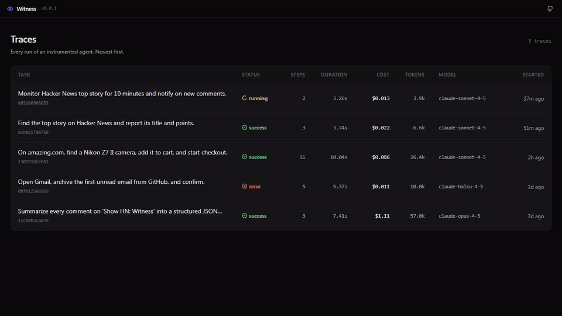
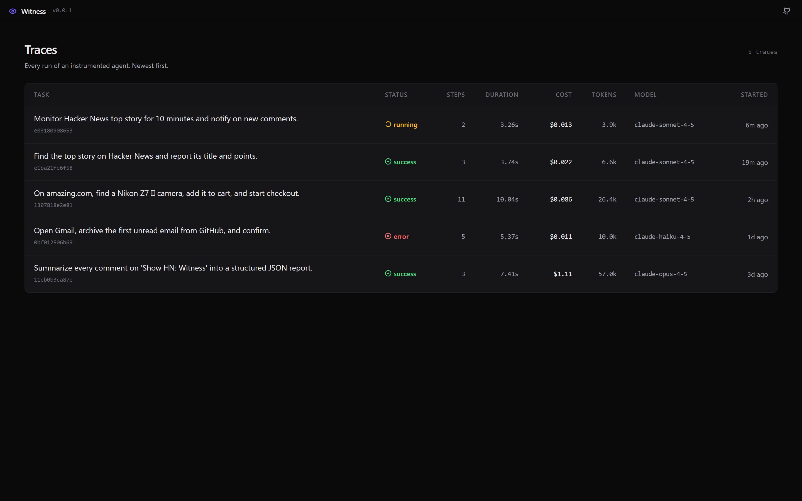
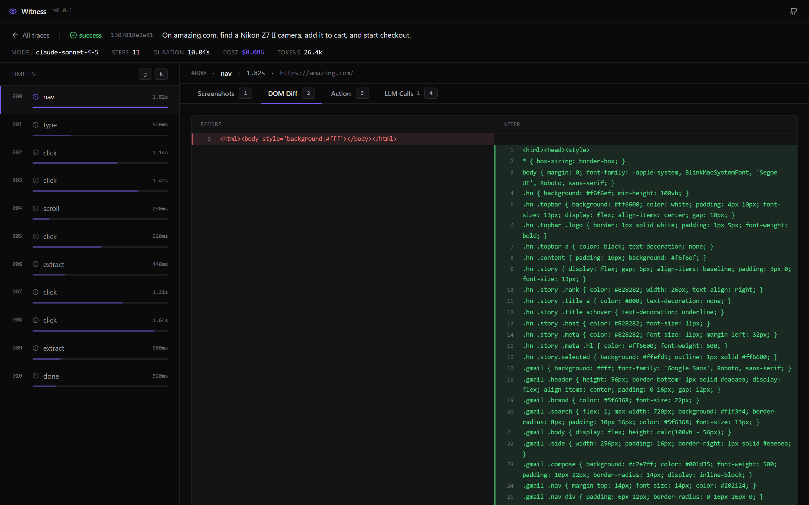
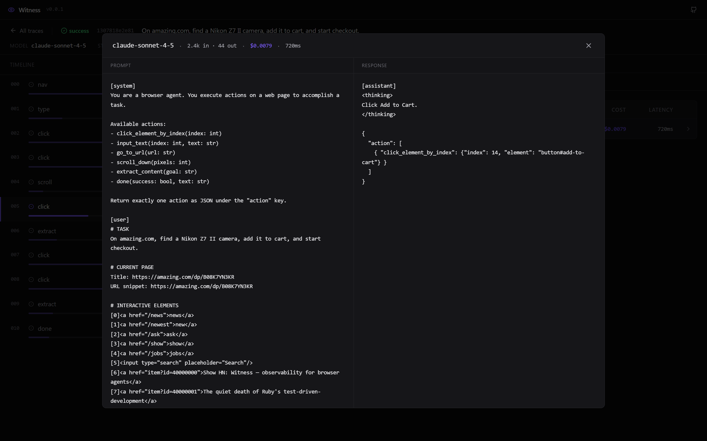

<div align="center">

# Witness

[](https://pypi.org/project/usewitness/)
[](https://pypi.org/project/usewitness/)
[](https://github.com/EricFinland/witness/blob/main/LICENSE)
[](https://twitter.com/usewitness)

**See what your browser agent actually did.**

Local-first observability for browser agents. DOM diffs, screenshot scrubbing, LLM cost per step, action replay — all in a viewer that lives on your machine.



</div>

---

## Install

```bash
pip install usewitness
playwright install chromium
```

```python
import asyncio
import witness
from browser_use import Agent
from browser_use.llm import ChatAnthropic

async def main():
    agent = Agent(
        task="Find the top story on Hacker News and return its title.",
        llm=ChatAnthropic(model="claude-sonnet-4-5"),
    )
    witness.instrument(agent)
    await agent.run()

asyncio.run(main())
```

```bash
witness view
```

Opens a viewer at `localhost:7842` with every step your agent took.

---

## Why this exists

Browser agents fail. A lot. Browser Use, Claude in Chrome, Operator, Skyvern — they all crash on step 7 of a 12-step workflow and leave you squinting at a stack trace that tells you nothing about *why*.

You need the DOM at the moment it broke. The screenshot before and after the click that went wrong. The exact prompt Claude saw when it picked the wrong button. The token cost of the retry loop that spiraled.

Witness captures all of it, automatically, with one line of code.

---

## What it captures

For every step an agent takes:

- **DOM before and after** — rendered as a side-by-side diff with line-level highlighting
- **Screenshots before and after** — with a compare slider so you can see what changed visually
- **The action** — structured JSON showing exactly what the agent tried to do
- **LLM calls** — model, tokens, cost, latency, full prompt and response
- **Errors** — captured with the step they occurred on, not buried in a trace

Everything is stored locally in SQLite + flat files under `~/.witness/`. Nothing leaves your machine.

---

## Screenshots


*Every run, with cost and step count at a glance.*


*Real side-by-side DOM diff — see exactly what the page did.*


*Full prompt and response for every LLM call. With cost.*

---

## How it works

Witness wraps your agent's `step()` method with a thin instrumentation layer. Before each step it snapshots the page (DOM + screenshot); after each step it records the action taken, the latency, and any error. LLM calls are captured via [OpenLLMetry](https://github.com/traceloop/openllmetry)'s OpenTelemetry instrumentation of the Anthropic and OpenAI SDKs — Witness attaches them to the correct step using a `ContextVar`.

Storage is SQLite (metadata) plus flat files (DOMs and screenshots) under `~/.witness/`. The viewer is a static Vite bundle served by a local FastAPI server. No cloud, no auth, no phone-home.

Claude Sonnet 4.5 and Opus 4.5 pricing are built in, as well as OpenAI GPT-4o, GPT-4.1, and the other common models. Unknown models log at $0 and raise a warning so you notice.

---

## Examples

Four recipes in [`examples/`](examples/) to copy from:

- [`hn_top_story.py`](examples/hn_top_story.py) — a simple successful run
- [`form_fill.py`](examples/form_fill.py) — contact form with multiple inputs
- [`multi_tab.py`](examples/multi_tab.py) — agent working across two tabs
- [`intentional_failure.py`](examples/intentional_failure.py) — a deliberately failing run, to show what error traces look like

---

## CLI

```bash
witness view              # open the viewer at localhost:7842
witness ls                # list recent traces in the terminal
witness rm <trace_id>     # delete a single trace
witness rm --all          # delete every trace (asks first)
witness config            # show config path and current settings
```

Telemetry is off by default and there is no toggle to turn it on. Witness never makes a network request you didn't ask for.

---

## Roadmap

Short list of what's coming, roughly in order:

- **Share links** — `witness share <trace_id>` uploads a trace to a hosted viewer so you can paste it into a bug report or a Slack thread
- **More frameworks** — Playwright-based agents first, then Claude in Chrome event streams
- **Regression detection** — run the same task against two model versions, diff the traces, alert on drift
- **Cost dashboards** — aggregate spend across traces and tasks

Full backlog: [`BACKLOG.md`](BACKLOG.md)

---

## Contributing

The SDK and viewer are both small enough to read in an afternoon. Good first issues are labeled [`good first issue`](https://github.com/EricFinland/witness/issues?q=label%3A%22good+first+issue%22) — currently around action-type icons, additional model pricing entries, and Playwright-agent instrumentation.

See [`CONTRIBUTING.md`](CONTRIBUTING.md) for dev setup.

---

## License

MIT. See [`LICENSE`](LICENSE).

Built by [Eric Catalano](https://github.com/EricFinland).
